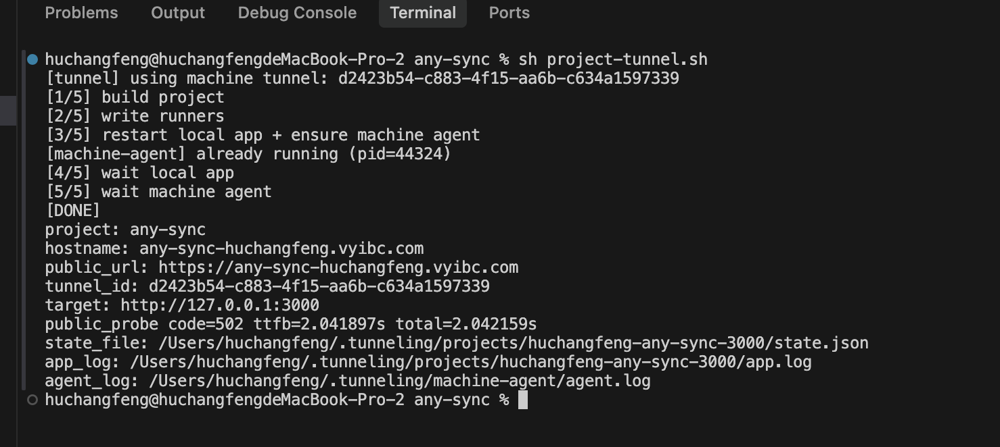
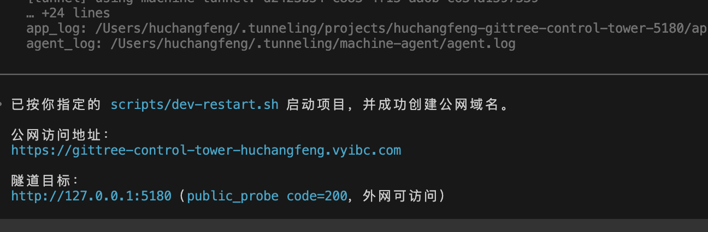
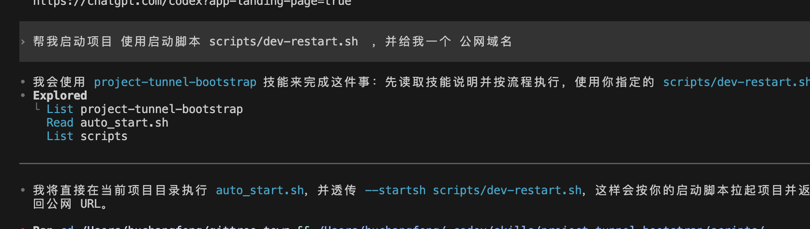

# Auto Domain

目标：用户只需要把 `project-tunnel.sh` 放到项目根目录并执行，即可获得公网访问域名。

## 本地使用（脚本方式）

### 1) 把脚本放到你的项目根目录

项目目录示例：

```text
my-project/
  ├─ project-tunnel.sh
  ├─ package.json
  └─ ...
```

### 2) 一键启动并分配公网域名

在项目根目录执行：

```bash
sh project-tunnel.sh start
```

如果你要指定端口：

```bash
sh project-tunnel.sh start --port 3000
```

如果你要先执行自己的启动脚本（如你截图中的 `scripts/dev-restart.sh`）：

```bash
sh project-tunnel.sh start --startsh scripts/dev-restart.sh
```

### 3) 看结果（重点看 `public_url`）

执行成功后输出会包含：

- `public_url: https://xxx.vyibc.com`（公网访问地址）
- `target: http://127.0.0.1:xxxx`（本地目标）
- `public_probe code=200`（外网可访问）

如果是 `public_probe code=502`，通常表示本地服务没起来或端口不对。

### 4) 常用命令

```bash
sh project-tunnel.sh status
sh project-tunnel.sh stop
```

## 本地使用（Skill 方式）

你也可以直接让 Codex 自动执行，不手动敲命令。

触发词示例：

- “启动我的项目，给我一个公网域名”
- “使用启动脚本 `scripts/dev-restart.sh` 并给我公网域名”

Skill（`auto-domain`）会自动完成：

- 识别项目目录
- 启动本地项目
- 分配并绑定公网域名
- 返回 `public_url`

## 项目目录（与用户相关）

- `scripts/project-tunnel.sh`: 可分发到业务项目根目录使用
- `skills/auto-domain/`: Skill 自动启动逻辑
- `sql/init.sql`: 数据库初始化脚本（仅保留这一份）

## 效果截图

### 脚本方式执行结果



### Skill 返回公网域名结果



### Skill 触发与执行过程


